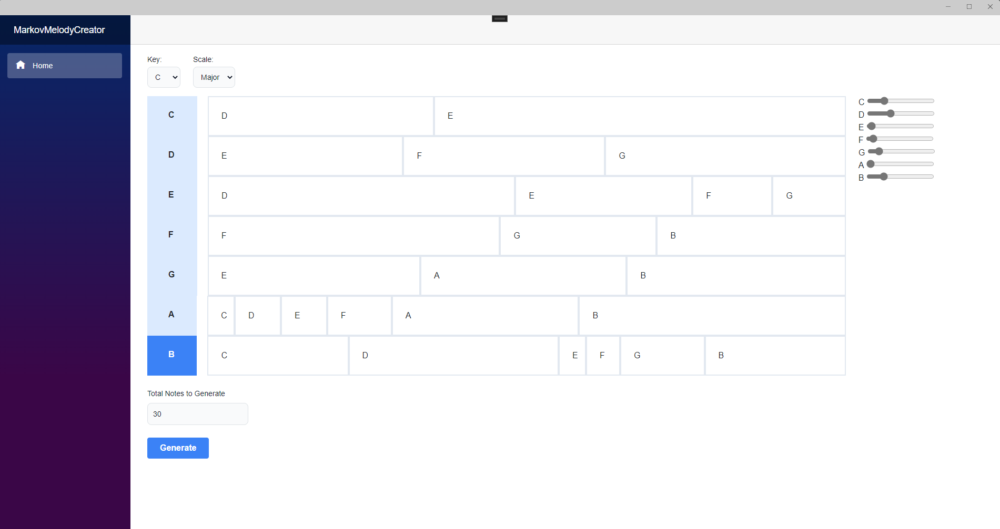
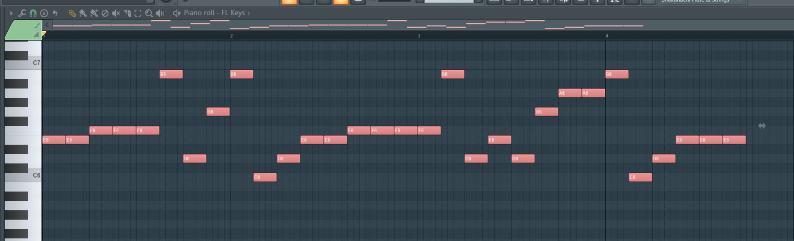

# MarkovMelodyCreator

A Maui Blazor app for randomly generating melodies using a Markov chain, saved as MIDI files.

## How it works

1. Choose a Key and Scale.
2. Select each note of the scale, and use the sliders on the right to tweak the probability of that note following the selected note.
3. Specify how long the melody should be.
4. Generate it!

